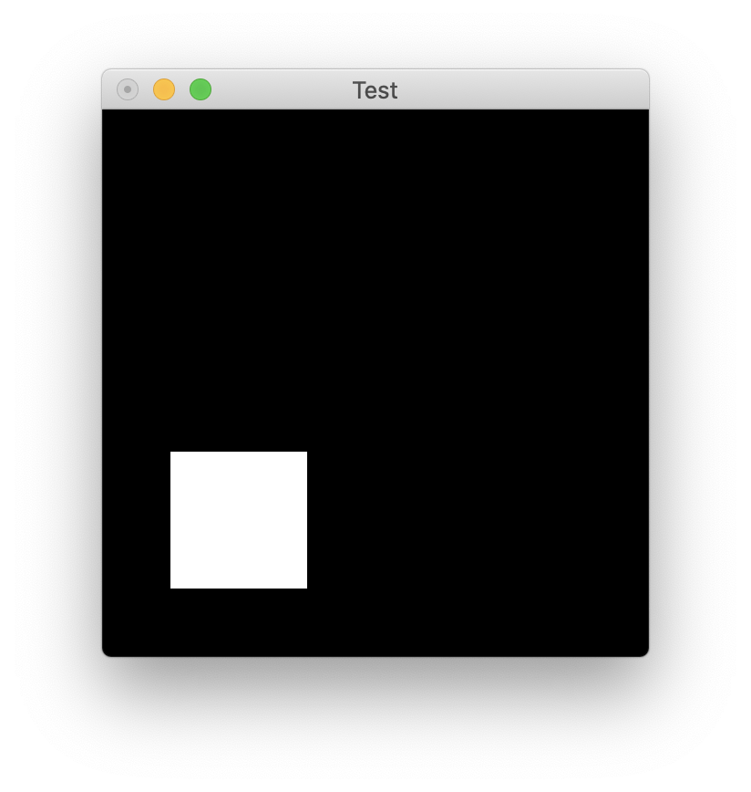
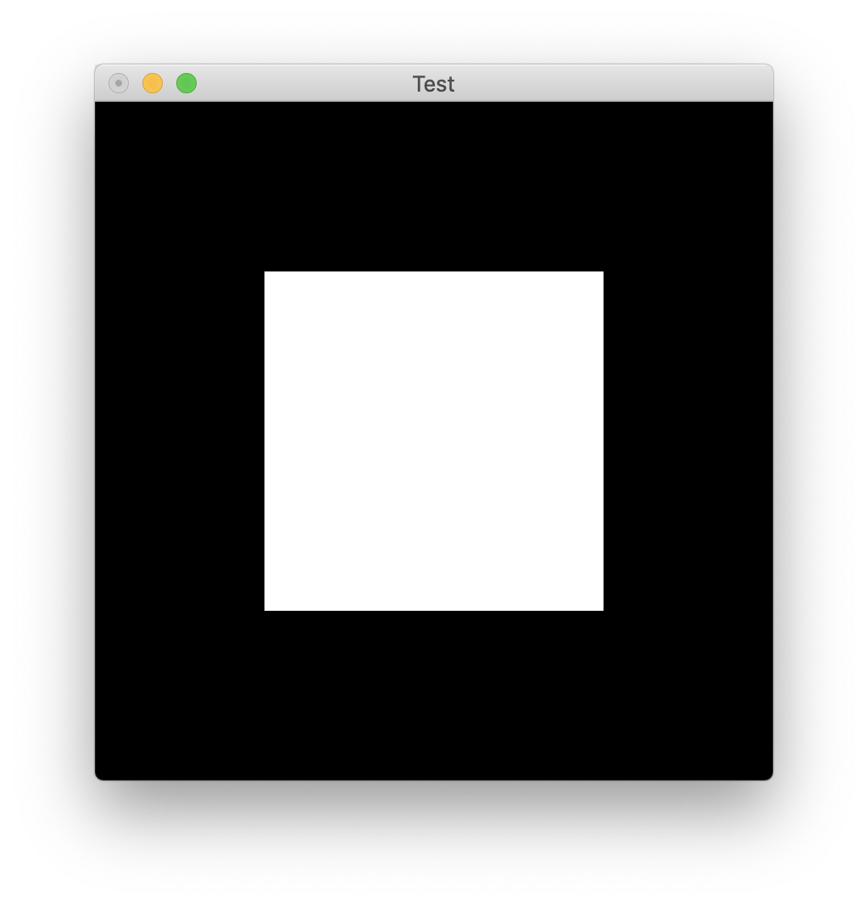

# 시작하며

무언가를 새롭게 배운다는 건 항상 두렵고도 가슴 설레는 일입니다.  
개인적인 의견이지만, 저는 어떤 지식을 처음 습득하는 그 순간을 굉장히 중요하게 생각합니다. 우리가 낯선 사람과 조우할 때 얻은 첫인상이 오래 남는 것처럼, 낯선 생각과 마주했을 때 받은 느낌이 이후의 학습에 영향을 미친다고 믿습니다. 그 생각이 머릿속에서 긍정적인 반응을 이끌어냈다면 이어지는 공부에 흥미를 가지고 전념할 수 있을 것입니다. 하지만 처음부터 난관에 부딪혔다고 느낀다면 후속 내용은 더 어렵게 느껴질 것이고 나아가 공부에 흥미를 느끼지 못할 수도 있습니다.

이런 관점에서 전산학은 빛과 어둠을 동시에 가지고 있습니다. 잠깐 상상의 나래를 펼쳐 프로그래밍을 처음 공부하는 사람이 되어 볼까요? 이제 당신은 처음 파이썬 수업을 들으러 온 수강생입니다. *(최근의 정세를 보았을 때 온라인 수업일 가능성이 큽니다만)* 모든 것이 순조롭습니다! 강사가 짚어주는대로 뭔지는 모르겠지만 *파이썬 인터프리터*라는 것을 당신의 노트북에 설치했고 *대화형 인터프리터*라는 것을 열었습니다. 이게 무엇인지는 모르겠지만 우선 하라는 대로 해봅니다. 그리고선 나타난 창에

```
print("Hello World")
```

을 입력하니 메아리처럼

```
>>> Hello World
```

가 되돌아 옵니다! 정말 신기한 일이 아닐 수 없습니다. 이로써 당신은 프로그래밍이 무엇을 하는 건지 잘은 모르겠지만 이게 재밌을 것 같다는 생각을 하게 됩니다. 물론 당장 내일이라도 벽을 만나 생각이 바뀌어 수업에서 뛰쳐 나갈지도 모르지만 우선은 이 공부가 흥미롭다고 생각합니다.

이게 우리가 생각하는 *입문자*의 모습입니다. 보다 디테일한 부분을 살펴보기 전에 이들에게 최우선적인 것은 *무언가 되고 있다는 느낌을 받는 것*입니다. 하지만 모든 게 파이썬처럼 간단하지는 않은 법이죠. 과거 전산학과 진입생들이 보통 첫 프로그래밍 언어로 공부하던 C언어는 어떨까요? C언어 코드를 실제로 실행시키기 위해서는 꽤나 많은 걸 알아야 합니다.

1. 우선 C언어로 작성된 소스 코드가 어떻게 기계어로 컴파일 되는지 알아야 합니다.
2. 여러 파일이 관여하는 예제라면 각각의 바이너리(기계어로 번역된 소스 코드)가 어떻게 연결되는지, 즉 링킹도 조금은 알아야 합니다.
3. 새로 빌드를 할 때마다 컴파일러에게 인자를 주는 게 귀찮으니 MakeFile이라는 것도 좋든 싫든 알게 됩니다. 다만 이걸 어떻게 작성해야 하는지는 모를 확률이 큽니다.
4. 점차 알아야 하는 게 많아집니다. IDE 혹은 에디터 사용법, 디버거 등등..  

**C언어가 무엇인지 배우기도 전에 C언어로 작성된 프로그램을 어떻게 실행시키는지 공부해야 하는 아이러니한 상황이 벌어진 겁니다.** 모종의 이유 때문에 오류라도 나면 (시키는대로 다 했는데도!) 당사자는 패닉에 빠지겠죠. 위에 설명한 내용들을 제대로 이해하려면 컴퓨터 시스템 개념들도 가져와야 하는데 과연 초보자가 그 내용들을 받아들일 수 있을까요?

이처럼 무언가를 배우기도 전에 실습환경을 만들면서 벽에 부딪혀 좌절했던 분들이 많으리라 생각합니다. 과거 저도 머신 러닝을 처음 공부할 때 아나콘다로 가상환경을 설정하면서 겪었던 일이고 얼마전 OpenGL 프로젝트 빌드 설정에서 또 한 번 고배를 마셨습니다. **이 글은 제가 겪었던 시행착오를 다른 누군가 겪지 않았으면 하는 마음에서 썼습니다.**

# 실습환경 요약 및 목표

제가 2021년 봄에 수강하는 컴퓨터 그래픽스 개론 수업에서는 Windows 10과 Visual Studio가 기준이 됩니다. 그러나 저는 macOS와 CLion을 사용하므로 Visual Studio가 제공하는 편리한 빌드 설정을 이용할 수 없었습니다. 하지만 저에게는 두 개의 프로젝트를 따로 버전 관리 하는 것이 굉장히 귀찮고 우아하지 못한 일이었고, 할 수 없이 CMake를 이용해 직접 빌드 과정을 설정하기로 했습니다. 저의 환경은 다음과 같습니다.

- 운영체제 (Operating System): **macOS Catalina 10.15.7** & **Microsoft Windows 10**
- 빌드 도구 (Build Tool): **CMake**
- 컴파일러 (Build Toolchain): macOS의 경우 **Clang** / Windows의 경우 **MSVC**
- 통합 개발 환경 (IDE): **CLion 2020.2**

> *macOS의 경우 Xcode Command Line Tool이 이미 설치되어 있다고 가정합니다.*

> 사용자가 CMake에 어느 정도 익숙하다고 가정합니다. 본 튜토리얼에서는 복잡한 기능이 사용되지 않고, 최대한 자세히 설명할 것입니다만 보다 자세한 내용은 공식 문서를 참고해주세요.

이 글은 우선적으로 macOS에서 OpenGL API를 사용하는 C/C++ 프로젝트를 빌드하기 위해서는 어떻게 해야하는지를 다룹니다. OpenGL과 GLUT과 같은 의존성을 잡아주는 것부터 시작해서 Retina 디스플레이로 인해 발생하는 문제를 해결하기 위한 방법을 제시합니다. macOS에서의 빌드가 해결되면 Windows 10에서도 빌드가 가능하도록 약간의 수정을 가합니다. 이후에도 설명하겠지만 CUI와 GUI를 구분하는 Windows 특성상 부가적인 작업이 필요합니다.

> 숙련된 개발자 분들께서 보시기에는 "왜 당연한 내용을 저렇게 장황하게 설명하지?"라는 생각이 들 수 있습니다. 우선 이 글의 대상 독자는 **컴퓨터 그래픽스 관련 과목을 수강하기 위해 OpenGL을 사용해야 하는 학부생**이라는 것을 밝힙니다. 하지만 이게 잘못된 정보의 전달에 대한 변명이 될 수는 없을 것입니다. 저 역시 현재 공부를 하고 있는 학부생이기에 제가 떠올린 해답이 비효율적일 수도 있고 어쩌면 아예 잘못됐을 수도 있습니다. 본문에 잘못된 내용이 있다면 부족한 제게 따끔한 지적 부탁드립니다.

# macOS에서의 OpenGL 설정

## OpenGL, GLUT 의존성 잡아주기

익히 알려진 사실이지만 Khronos Group에서 관리하는 OpenGL은 일종의 설계도에 불과합니다. 컴퓨터에서 그래픽 연산을 수행하는데 유용한 여러 함수들을 정의하는 것은 맞지만 OpenGL 표준은 *함수의 입출력이 무엇이며*, *함수의 작동 방식이 어떠해야 한다*와 같은 추상적인 내용만을 담고 있습니다.

크로스 플랫폼을 지향하는 OpenGL의 철학 때문에 각양각색의 기기에서 작동해야 하니 공식적인 구현을 정하기는 어려웠을 것입니다. 때문에 실제 OpenGL을 코드로 구현하는 책임은 보통 하드웨어 개발사에 있습니다. Nvidia의 경우 자사의 GPU 드라이버와 호환되는 OpenGL 구현을, Apple의 경우 Mac 하드웨어와 macOS와 호환되는 OpenGL 구현을 만드는 것입니다. 

> *다만, 2018년에 Apple이 자사의 Metal을 표준 그래픽 라이브러리로 공표함에 따라 OpenGL은 deprecated 상태입니다.  최악의 경우 가까운 미래에 시스템에서 삭제될 가능성도 있습니다.*

macOS에는 기본적으로 그래픽 연산을 위한 OpenGL과 유저 인터페이스 및 이벤트 제어를 위한 라이브러리인 GLUT이 탑재되어 있습니다. Xcode를 이용한다면 간단히 사용할 수 있겠지만 우리는 플랫폼 간 호환성을 위해 편의성을 희생하고 CLion과 CMake를 사용하므로 별도의 설정이 필요합니다. 이해하시기 쉽도록 창에 사각형을 띄우는 간단한 예제와 함께 살펴보겠습니다. `CMakeLists.txt`라는 파일에 프로젝트의 소스 파일이 어떻게 빌드되어야 하는지 명시하는 것부터 시작합니다.

### CMakeLists.txt 작성하기

OpenGL을 이용해 무언가를 만들기 위해서는 반드시 OpenGL이 구현한 함수들의 정의가 담긴 C 헤더 파일과 컴파일 된 바이너리, 즉 라이브러리가 필요합니다. 또한 우리는 GUI 프로그램을 만들 것이기 때문에 GUI 이벤트 핸들링을 위해 GLUT이라는 라이브러리도 사용할 것입니다. 마찬가지로 GLUT의 헤더 파일과 컴파일 된 바이너리가 필요합니다. 이들이 있어야 프로젝트를 빌드할 수 있습니다. 그럼 어떻게 CMake에게 OpenGL과 GLUT이 어디 있는지 알려줄 수 있을까요? 

CLion에서 C++ 프로젝트를 생성하면 기본적으로 빌드 툴이 CMake로 설정된 프로젝트가 만들어집니다. CMakeLists.txt 파일을 열고 아래와 같이 내용을 추가합니다.

---

```cmake
cmake_minimum_required(VERSION 3.17)
project(opengl_setting)

set(CMAKE_CXX_STANDARD 14)

if (APPLE)
    # Find OpenGL
    find_package(OpenGL REQUIRED)
    if (${OpenGL_FOUND})
        MESSAGE(STATUS "Found OpenGL.")
    else(${OpenGL_FOUND})
        MESSAGE(STATUS "Could not locate OpenGL.")
    endif (${OpenGL_FOUND})

    # Find GLUT
    find_package(GLUT REQUIRED)
    if (${GLUT_FOUND})
        MESSAGE(STATUS "Found GLUT.")
    else(${GLUT_FOUND})
        MESSAGE(STATUS "Could not locate GLUT.")
    endif (${GLUT_FOUND})
endif()

add_executable(opengl_setting main.cpp)
```

---

CMake 버전이나 프로젝트의 이름(저는 *opengl_setting*이라고 지었습니다), C++ 버전을 명시하는 위의 세 줄은 그리 중요하지 않습니다. 우리가 주의 깊게 보아야 하는 것은 if문 안의 내용입니다. 위의 내용을 보면, 우리는 CMake에게 다음과 같이 지시를 하고 있습니다.

> "만약에 네가 macOS 위에서 이 문서를 읽는다면, OpenGL과 GLUT을 찾아. 찾았으면 찾았다고, 못 찾았으면 못 찾았다고 말해줘."

그리고 main.cpp 파일을 다음과 같이 작성합니다.

```cpp
#include <iostream>

#ifdef __APPLE__
#include <OpenGL/gl.h>
#include <GLUT/glut.h>
#define GL_SILENCE_DEPRECATION
#endif

// set window size
int width = 400;
int height = 400;

// display white rectangle in the middle of the screen
void display() {
    glClear(GL_COLOR_BUFFER_BIT);
    glBegin(GL_POLYGON);
    glVertex3f(-0.5, -0.5, 0.0);
    glVertex3f(0.5, -0.5, 0.0);
    glVertex3f(0.5, 0.5, 0.0);
    glVertex3f(-0.5, 0.5, 0.0);
    glEnd();
    glFlush();
}

int main(int argc, char** argv) {
    glutInit(&argc, argv);
    glutInitWindowSize(width, height);
    glutCreateWindow("Test");
    glutDisplayFunc(display);
    glutMainLoop();
}
```

이 코드는 OpenGL에게 검은색 바탕에 흰색 사각형을 그리게 하고, 그 내용을 GLUT을 통해 화면에 출력하라는 내용을 담고 있습니다. 간단한 예제입니다. 하지만 우리가 작성한 CMakeLists.txt 파일만으로는 빌드가 되지 않습니다. 아마 Undefined Symbol 에러가 날 것입니다. 우리는 CMake에게 방금 빌드한 바이너리와 라이브러리를 링크해달라는 요청을 해야 합니다. 따라서 아래의 내용을 CMakeLists.txt 하단에 추가합니다.

```cmake
target_link_libraries(opengl_setting "-framework OpenGL")
target_link_libraries(opengl_setting "-framework GLUT")
```

### Retina Display Mac에서의 뷰포트 크기 문제 해결하기

이제 실행을 해보면...!

<figure>
    
</figure>

무언가 잘못 되었습니다. 본래 OpenGL은 렌더링에 $x$축과 $y$축 모두 [-1, 1]로 정규화된 화면 좌표계를 사용하므로 우리가 짠 코드대로라면 화면 중앙에 커다란 흰색 사각형이 그려져야 맞습니다. 그런데 왜 이런 일이 일어난 것일까요? **원인은 Retina Display의 해상도에 있습니다.** 이 문제를 해결하기 위해서는 `display` 함수의 첫 부분에 다음과 같은 코드를 추가합니다.

```cpp
...
void display() {

#ifdef __APPLE__
    glViewport(0, 0, 2 * width, 2 * height);
#endif

...
}
```

빌드 환경이 macOS일 때만 전처리기에 의해 코드에 삽입되는 이 명령어는 뷰포트의 크기가 GLUT이 생성하는 창의 크기의 4배가 되게끔 (각각 가로 2배, 세로 2배이므로) 설정합니다. 그럼 다시 빌드하고 실행해볼까요?

> 다만 저도 이게 구체적으로 왜 작동하는지는 아직 잘 모릅니다. 왜 이 방법이 작동하는지 알게 되는대로 내용을 추가하겠습니다.

<figure>
    
</figure>

성공입니다! 코드의 원래 의도대로 화면 중앙에 사각형이 자리잡고 있는 것을 볼 수 있습니다. 이로써 macOS에서 CMake를 이용해 OpenGL, GLUT 등 외부 종속성을 올바르게 링크하고, Retina Display를 사용하는 Mac 모델에서 화면이 올바르게 출력되지 않는 오류를 해결했습니다. 급한 불을 하나 껐으니 이어서 Windows 환경에서도 프로젝트가 빌드될 수 있도록 설정해보겠습니다.

## Windows에서의 OpenGL 설정

## OpenGL, GLEW, GLUT 설치 및 의존성 잡아주기

